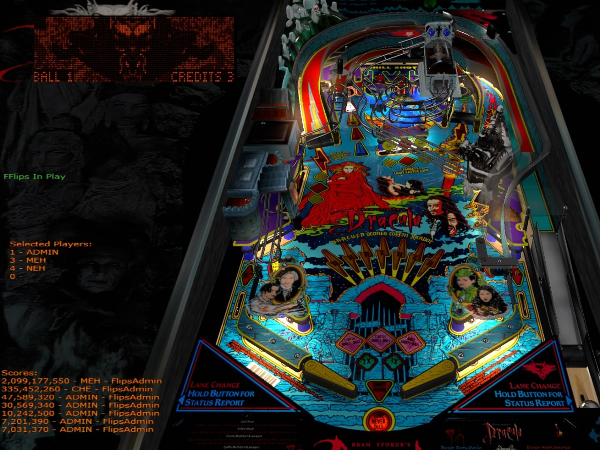
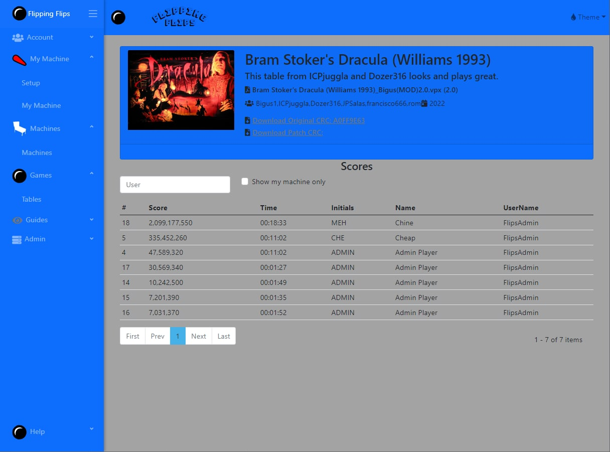

# Flipping Flips - High Score Keeper
---

Score keeper for API pinball simulations. A user account which is their virtual pinball machine or computer which can hold multiple players.

The uers can post scores with API_Key from their simulation using a controller [flippingflips-controller-com](https://github.com/FlippingFlips/flippingflips-controller-com) which is activated in the games script.

The idea is to make it as simple as possible with little to no configuration on the users side, no script editing, configuring or using external applications to start a game. 

### Supported Games
---
Simulation and Game Types that can be used and have been tested are:

- Visual Pinball - Original Scripted Tables
- Future Pinball (BAM) - Original Scripted Tables
- Visual Pinball - PinMame (Requires mappings for game and custom callbacks in script)
- PinGod (TODO)

#### PinMame

PinMame available mappings: [tomlogic - PinMame-NvRamMaps](https://github.com/tomlogic/pinmame-nvram-maps)

Helper app (windows) to create maps: [Dotnet-NvRamMaps](https://github.com/horseyhorsey/PinMAME.NvMaps)

### Simulation Menus (user interfaces)
---
Any UI should be built into the simulator which allows the user to create players, select their players for a game, clear selected players, display their scores and display any server errors as feedback for the user. There are methods in the controller to pull this data back from the server. Controls should be limited to Flippers and Start buttons (aside from using keyboard to add a new player to server)

- Visual Pinball Desktop UI (OK) (both flippers activate menu if no game is started)
- Visual Pinball Cabinet UI (Non Existent)
- Future Pinball Desktop UI (Non Existent)
- Future Pinball Cabinet UI (Non Existent)

### Web Frontend (Blazor)
---

## Tech Stack
---

- Dotnet Core 6.0.11
- Microsoft.EntityFrameworkCore.Sqlite
- [AspNetCoreRateLimit](https://github.com/stefanprodan/AspNetCoreRateLimit) - Rate limit endpoints, see `appsettings.json/ClientRateLimiting`
- IdentityServer - ClientId (oidc) and JWT Tokens
- Swagger API documentation
- CQRS - Mediatr
- Automapper
- Blazorise (Bootstrap UI)

## How to run this repository

### Download Sub Modules
---

`git submodule foreach git pull origin main`

### Database Setup
---

#### Build migration files from the `FF.Api` project directory.

1. `dotnet ef migrations add Initial -o Data/Migrations -p ../Domain/FF.Infrastructure`

#### Running the `FF.Api` application will build database and seed initial data.

2. `dotnet run`

SQL files used to seed:

- Names.SQL
- Games.SQL
- Mappings.SQL

Other SQL are for tests, design.

### Settings - Changing Default User Accounts
---

Update the `DatabaseModelCreationOptions` in `appsettings.json`. This section populates the database with initial user accounts, players and roles. 

See [ApplicationDbContext]
